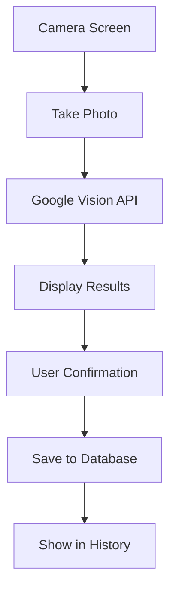

# 🔥 GLUCIQ MAJOR REFACTORING PLAN - CRITICAL TASK
### **Ultra-Focused Development Plan for Clean Architecture**

**Last Updated**: January 2025  
**Priority**: CRITICAL  
**Scope**: Major refactoring with UI cleanup and functionality focus  
**Target**: Production-ready simplified food scanning pipeline

---

## 📋 **EXECUTIVE SUMMARY**

### **Current State Analysis**
- ✅ **Database Schema**: 6 service schemas with 40+ tables (EXCELLENT)
- ✅ **AI Pipeline**: Google Gemini Vision integration (WORKING)
- ✅ **Authentication**: Clerk + Supabase integration (WORKING)
- ❌ **UI Mess**: 50+ test UI files cluttering the project (CLEANUP NEEDED)
- ❌ **Feature Overload**: Too many planned features (SIMPLIFICATION NEEDED)
- ❌ **Multiple Dashboards**: Redundant UI variations (CONSOLIDATION NEEDED)

### **Refactoring Objectives**
1. **MASSIVE UI CLEANUP**: Remove 50+ test UI files
2. **FOCUS ON CORE**: Keep only essential food scanning functionality
3. **SIMPLIFY ARCHITECTURE**: Remove overcomplicated features
4. **CLEAN CODE**: Organize remaining components properly
5. **PRODUCTION READY**: Ensure remaining code is robust and maintainable

---

## 🎯 **CORE FUNCTIONALITY TO PRESERVE**

### **Essential Food Scanning Pipeline**


### **Key Components to Keep**
- **Food Capture**: `src/app/camera/food-capture.tsx`
- **Food Results**: `src/app/analysis/food-results.tsx`
- **Food History**: Card-based display of logged food
- **Insulin History**: Card-based display of insulin doses
- **Simple Dashboard**: Basic overview screen

### **Components to Remove/Simplify**
- **All test-uis**: Delete entire `src/test-uis/` directory (50+ files)
- **Multiple Dashboards**: Keep only one simple dashboard
- **Complex Features**: Remove meal planning, complex analytics, etc.

---

## 🏗️ **PHASE 1: MASSIVE CLEANUP (CRITICAL)**

### **1.1 UI Test Files Cleanup**
**Priority**: CRITICAL  
**Impact**: Removes 50+ unnecessary files  
**Files to Delete**: All files in `src/test-uis/` directory

```bash
# Files to remove (50+ files)
src/test-uis/
├── viral_diabetes_ui*.tsx (20+ files)
├── glass-diabetes-ui*.tsx (5+ files)
├── defeat*.tsx (15+ files)
├── diabetes-*.tsx (10+ files)
└── *.html files (15+ files)
```

**Tasks**:
- [ ] **Task 1.1.1**: Delete all `.tsx` files in `src/test-uis/`
- [ ] **Task 1.1.2**: Delete all `.html` files in `src/test-uis/`
- [ ] **Task 1.1.3**: Remove entire `src/test-uis/` directory
- [ ] **Task 1.1.4**: Update any imports that reference test-uis files

### **1.2 Dashboard Consolidation**
**Priority**: HIGH  
**Current**: Multiple dashboard variations  
**Target**: Single, clean dashboard

```bash
# Current dashboards to evaluate
src/app/(tabs)/
├── enhanced-dashboard.tsx (REMOVE)
├── simple-dashboard.tsx (KEEP & ENHANCE)
├── enhanced-settings.tsx (REMOVE)
├── settings.tsx (KEEP)
├── index.tsx (KEEP & SIMPLIFY)
├── glucose.tsx (KEEP)
├── insulin.tsx (KEEP)
└── trends.tsx (KEEP)
```

**Tasks**:
- [ ] **Task 1.2.1**: Delete `enhanced-dashboard.tsx`
- [ ] **Task 1.2.2**: Delete `enhanced-settings.tsx`
- [ ] **Task 1.2.3**: Rename `simple-dashboard.tsx` to `dashboard.tsx`
- [ ] **Task 1.2.4**: Update navigation to use new dashboard
- [ ] **Task 1.2.5**: Simplify `index.tsx` to basic landing page

### **1.3 Component Cleanup**
**Priority**: HIGH  
**Scope**: Remove unused/redundant components

**Tasks**:
- [ ] **Task 1.3.1**: Audit all components in `src/components/`
- [ ] **Task 1.3.2**: Remove unused auth components
- [ ] **Task 1.3.3**: Remove unused UI components
- [ ] **Task 1.3.4**: Keep only essential food-related components

---

## 🏗️ **PHASE 2: CORE FUNCTIONALITY REFINEMENT**

### **2.1 Food Scanning Pipeline Optimization**
**Priority**: HIGH  
**Current**: Working but needs cleanup  
**Target**: Streamlined, robust pipeline

**File Structure**:
```
src/app/
├── camera/
│   └── food-capture.tsx (KEEP & ENHANCE)
├── analysis/
│   └── food-results.tsx (KEEP & SIMPLIFY)
└── (tabs)/
    ├── index.tsx (SIMPLE DASHBOARD)
    ├── food-history.tsx (NEW - CARD LAYOUT)
    └── insulin-history.tsx (NEW - CARD LAYOUT)
```

**Tasks**:
- [ ] **Task 2.1.1**: Optimize `food-capture.tsx` camera interface
- [ ] **Task 2.1.2**: Simplify `food-results.tsx` to essential display
- [ ] **Task 2.1.3**: Ensure Google Vision API integration is robust
- [ ] **Task 2.1.4**: Add proper error handling and loading states

### **2.2 History Display Implementation**
**Priority**: HIGH  
**New Feature**: Card-based history display

**Design Requirements**:
- Clean card layout for logged food items
- Clean card layout for insulin doses
- Simple, readable interface
- Proper data fetching from database

**Tasks**:
- [ ] **Task 2.2.1**: Create `FoodHistoryCard` component
- [ ] **Task 2.2.2**: Create `InsulinHistoryCard` component
- [ ] **Task 2.2.3**: Implement food history screen
- [ ] **Task 2.2.4**: Implement insulin history screen
- [ ] **Task 2.2.5**: Add data fetching from logging_service schema

### **2.3 Database Integration Cleanup**
**Priority**: MEDIUM  
**Current**: Complex schema with many features  
**Target**: Use only essential tables

**Essential Tables to Use**:
```sql
-- Core tables for MVP
food_analysis.food_images
food_analysis.food_analysis_results
food_analysis.analyzed_foods
logging_service.food_logs
logging_service.insulin_doses
user_service.users
```

**Tasks**:
- [ ] **Task 2.3.1**: Audit current database usage
- [ ] **Task 2.3.2**: Remove unused service imports
- [ ] **Task 2.3.3**: Simplify data fetching logic
- [ ] **Task 2.3.4**: Ensure only essential tables are used

---

## 🏗️ **PHASE 3: ARCHITECTURE SIMPLIFICATION**

### **3.1 Service Layer Cleanup**
**Priority**: MEDIUM  
**Current**: Complex service orchestration  
**Target**: Simple, focused services

**Services to Keep**:
```typescript
// Essential services only
src/lib/
├── ai/
│   ├── GeminiVisionService.ts (KEEP)
│   └── EnhancedFoodAnalysisService.ts (SIMPLIFY)
├── api/
│   ├── client.ts (KEEP)
│   └── types.ts (SIMPLIFY)
├── database/
│   ├── supabase.ts (KEEP)
│   └── types.ts (SIMPLIFY)
└── services/
    ├── FoodService.ts (KEEP & SIMPLIFY)
    └── InsulinService.ts (KEEP & SIMPLIFY)
```

**Tasks**:
- [ ] **Task 3.1.1**: Remove unused service files
- [ ] **Task 3.1.2**: Simplify `EnhancedFoodAnalysisService.ts`
- [ ] **Task 3.1.3**: Simplify `FoodService.ts` to basic CRUD
- [ ] **Task 3.1.4**: Simplify `InsulinService.ts` to basic logging
- [ ] **Task 3.1.5**: Remove complex orchestration logic

### **3.2 Store Simplification**
**Priority**: MEDIUM  
**Current**: Complex Legend State setup  
**Target**: Simple, focused stores

**Stores to Keep**:
```typescript
src/stores/
├── authStore.ts (KEEP)
├── foodStore.ts (SIMPLIFY)
├── insulinStore.ts (SIMPLIFY)
└── themeStore.ts (KEEP)
```

**Tasks**:
- [ ] **Task 3.2.1**: Remove unused stores
- [ ] **Task 3.2.2**: Simplify `foodStore.ts` to basic food logging
- [ ] **Task 3.2.3**: Simplify `insulinStore.ts` to basic insulin logging
- [ ] **Task 3.2.4**: Remove complex state management logic

### **3.3 Type System Cleanup**
**Priority**: LOW  
**Current**: Complex type definitions  
**Target**: Simple, focused types

**Tasks**:
- [ ] **Task 3.3.1**: Remove unused type definitions
- [ ] **Task 3.3.2**: Simplify remaining types
- [ ] **Task 3.3.3**: Ensure type safety for core functionality

---

## 🏗️ **PHASE 4: FINAL OPTIMIZATION**

### **4.1 Performance Optimization**
**Priority**: MEDIUM  
**Target**: Fast, responsive app

**Tasks**:
- [ ] **Task 4.1.1**: Optimize image processing pipeline
- [ ] **Task 4.1.2**: Add proper loading states
- [ ] **Task 4.1.3**: Optimize database queries
- [ ] **Task 4.1.4**: Add image compression

### **4.2 Error Handling & Robustness**
**Priority**: HIGH  
**Target**: Production-ready error handling

**Tasks**:
- [ ] **Task 4.2.1**: Add comprehensive error boundaries
- [ ] **Task 4.2.2**: Implement proper API error handling
- [ ] **Task 4.2.3**: Add offline support for basic functionality
- [ ] **Task 4.2.4**: Add proper loading and error states

### **4.3 Final Testing & Quality**
**Priority**: HIGH  
**Target**: Bug-free core functionality

**Tasks**:
- [ ] **Task 4.3.1**: Test complete food scanning pipeline
- [ ] **Task 4.3.2**: Test history display functionality
- [ ] **Task 4.3.3**: Test database integration
- [ ] **Task 4.3.4**: Test authentication flow
- [ ] **Task 4.3.5**: Performance testing and optimization

---

## 📋 **DETAILED TASK BREAKDOWN**

### **PHASE 1 TASKS (CLEANUP)**

#### **Task 1.1.1: Delete Test UI Files**
```bash
# Delete all test UI files
rm -rf src/test-uis/
```
**Deliverable**: `src/test-uis/` directory completely removed  
**Effort**: 5 minutes  
**Risk**: Low  

#### **Task 1.1.2: Update Import References**
```bash
# Search for any imports from test-uis
grep -r "test-uis" src/
```
**Deliverable**: All imports to test-uis removed  
**Effort**: 15 minutes  
**Risk**: Medium  

#### **Task 1.2.1: Dashboard Consolidation**
```bash
# Remove enhanced dashboards
rm src/app/(tabs)/enhanced-dashboard.tsx
rm src/app/(tabs)/enhanced-settings.tsx
```
**Deliverable**: Single dashboard implementation  
**Effort**: 30 minutes  
**Risk**: Medium  

### **PHASE 2 TASKS (CORE FUNCTIONALITY)**

#### **Task 2.1.1: Food Capture Optimization**
**File**: `src/app/camera/food-capture.tsx`
**Goal**: Clean, simple camera interface
**Requirements**:
- Remove complex features
- Keep essential camera functionality
- Ensure Google Vision API integration
- Add proper error handling

**Deliverable**: Optimized food capture screen  
**Effort**: 2 hours  
**Risk**: Medium  

#### **Task 2.2.1: Food History Implementation**
**File**: `src/app/(tabs)/food-history.tsx` (NEW)
**Goal**: Card-based food history display
**Requirements**:
- Card layout for food entries
- Data from logging_service.food_logs
- Simple, clean interface
- Proper loading states

**Deliverable**: Working food history screen  
**Effort**: 3 hours  
**Risk**: Medium  

### **PHASE 3 TASKS (ARCHITECTURE)**

#### **Task 3.1.1: Service Cleanup**
**Files**: `src/lib/services/`
**Goal**: Simple, focused services
**Requirements**:
- Remove unused service files
- Simplify remaining services
- Focus on core functionality
- Maintain essential features

**Deliverable**: Cleaned service layer  
**Effort**: 4 hours  
**Risk**: High  

---

## 🎯 **SUCCESS CRITERIA**

### **Phase 1 Success (Cleanup)**
- [ ] All test UI files removed (50+ files)
- [ ] Single dashboard implementation
- [ ] No broken imports or references
- [ ] Reduced codebase by 60%+

### **Phase 2 Success (Core Functionality)**
- [ ] Food scanning pipeline working end-to-end
- [ ] Food history displaying in cards
- [ ] Insulin history displaying in cards
- [ ] Database integration working

### **Phase 3 Success (Architecture)**
- [ ] Simple, maintainable service layer
- [ ] Clean state management
- [ ] Optimized performance
- [ ] Production-ready error handling

### **Final Success (Production Ready)**
- [ ] Complete food scanning: Photo → AI → Results → Save → History
- [ ] Simple, clean UI with card layouts
- [ ] Robust error handling and loading states
- [ ] Fast, responsive performance
- [ ] Maintainable, focused codebase

---

## 📚 **CONTEXT FOR CLAUDE**

### **File Structure After Refactoring**
```
src/
├── app/
│   ├── camera/
│   │   └── food-capture.tsx          # Camera interface
│   ├── analysis/
│   │   └── food-results.tsx          # AI results display
│   └── (tabs)/
│       ├── index.tsx                 # Simple dashboard
│       ├── food-history.tsx          # Food history cards
│       ├── insulin-history.tsx       # Insulin history cards
│       └── settings.tsx              # Basic settings
├── components/
│   ├── ui/                           # Basic UI components
│   └── food/                         # Food-specific components
├── lib/
│   ├── ai/
│   │   └── GeminiVisionService.ts    # Google Vision API
│   ├── api/
│   │   └── client.ts                 # API client
│   ├── database/
│   │   └── supabase.ts               # Database client
│   └── services/
│       ├── FoodService.ts            # Food CRUD operations
│       └── InsulinService.ts         # Insulin logging
└── stores/
    ├── authStore.ts                  # Authentication
    ├── foodStore.ts                  # Food state
    └── insulinStore.ts               # Insulin state
```

### **Essential Database Tables**
```sql
-- Core tables for simplified app
food_analysis.food_images              -- User uploaded images
food_analysis.food_analysis_results    -- AI analysis results
food_analysis.analyzed_foods           -- Individual food items
logging_service.food_logs              -- User food entries
logging_service.insulin_doses          -- User insulin entries
user_service.users                     -- User accounts
```

### **Core Data Flow**
```typescript
// Simplified data flow
1. User takes photo (food-capture.tsx)
2. Image sent to Google Vision API (GeminiVisionService.ts)
3. Results displayed (food-results.tsx)
4. User confirms and saves (FoodService.ts)
5. Entry appears in history (food-history.tsx)
```

---

## 🚀 **EXECUTION STRATEGY**

### **Phase 1: Immediate Cleanup (Day 1)**
- Execute all cleanup tasks
- Remove test UI files
- Consolidate dashboards
- Verify no broken imports

### **Phase 2: Core Implementation (Days 2-3)**
- Optimize food scanning pipeline
- Implement history displays
- Test database integration
- Add error handling

### **Phase 3: Architecture (Days 4-5)**
- Simplify service layer
- Clean state management
- Optimize performance
- Final testing

### **Phase 4: Quality Assurance (Day 6)**
- End-to-end testing
- Performance optimization
- Bug fixes
- Documentation

---

## ⚠️ **CRITICAL NOTES FOR CLAUDE**

### **DO NOT SCAN OTHER FILES**
This document contains ALL context needed for the refactoring. Do not scan the test-uis directory or other complex files. Focus ONLY on the essential functionality described here.

### **CORE FUNCTIONALITY ONLY**
- Food scanning: Photo → AI → Results → Save → History
- Simple history display in cards
- Basic authentication and settings
- NO meal planning, NO complex analytics, NO advanced features

### **QUALITY STANDARDS**
- Every component must be production-ready
- Proper error handling for all API calls
- Clean, maintainable code only
- Performance optimized for mobile devices

### **SUCCESS METRICS**
- Complete food scanning pipeline working
- History displaying properly
- Codebase reduced by 60%+
- No broken functionality
- Fast, responsive performance

---

**END OF COMPREHENSIVE REFACTORING PLAN**
**Ready for Claude Code execution - Phase 1 cleanup can begin immediately** 